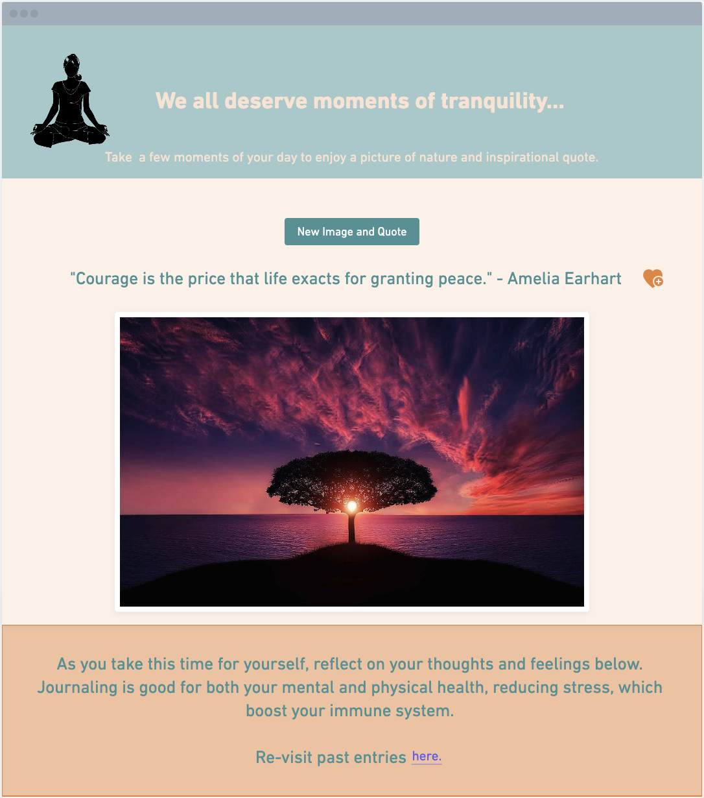
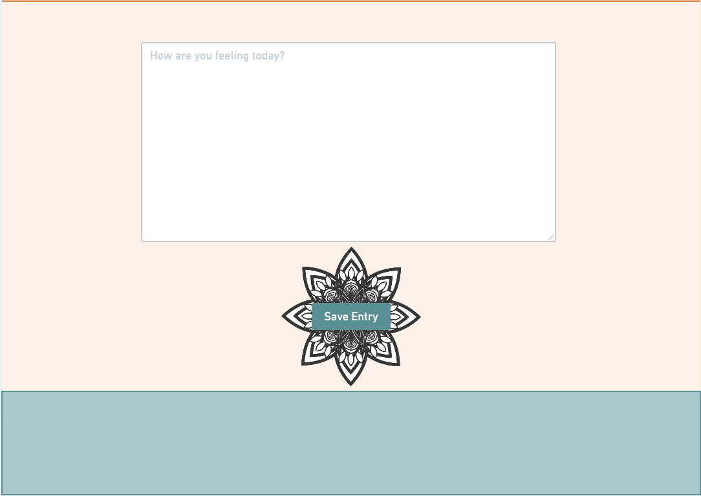
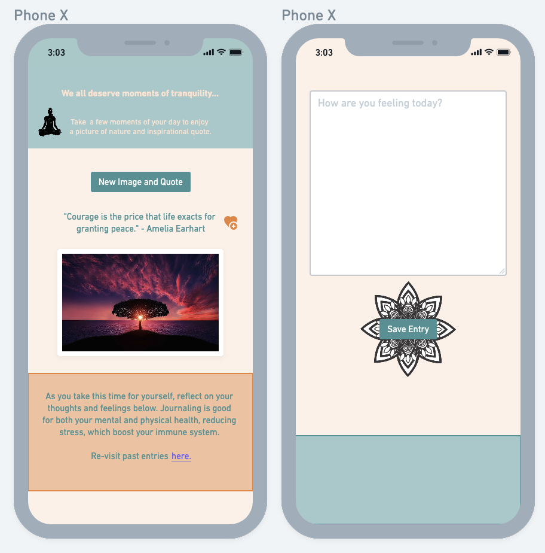
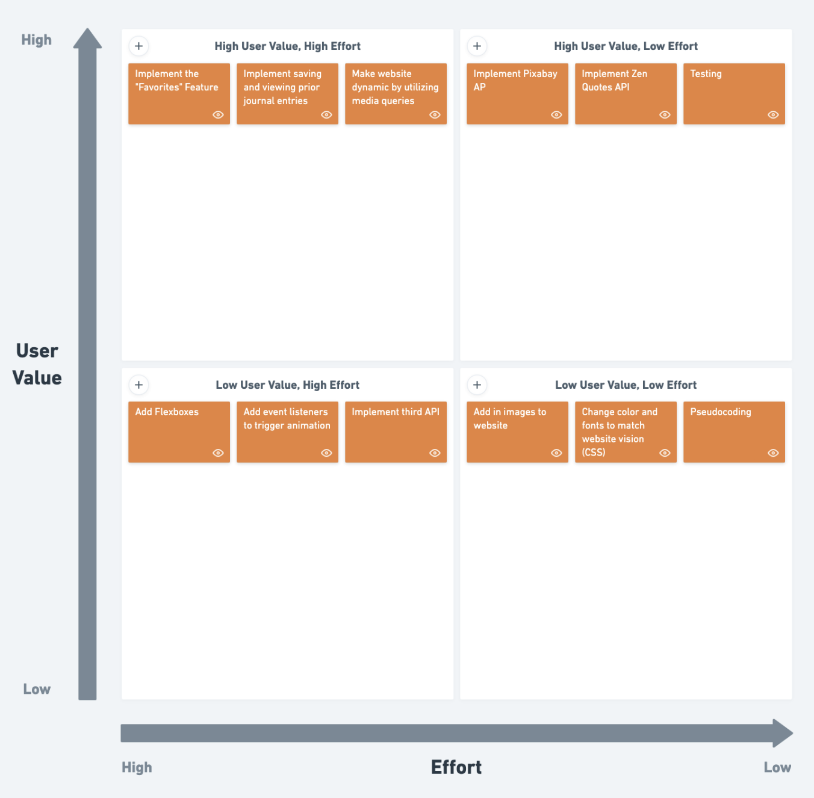

# [Tranquility App](https://kimcapgab.github.io/Tranquility_App/)

### App Description:

The Tranquility app was created to give people an opportunity to take a break from the everyday demand in a fast paced enviroment. It will allow the user to press a button that will generate a random inspirational quote, as well as a random picture of nature. It will also allow the user to journal their thoughts and take a break to refresh their minds. The app will also store any favorite quotes and past journal entries as well.

### API:

1. Pixabay API - https://pixabay.com/api/docs/
2. Zenquotes API - https://zenquotes.io/api/

### API Snippet:

1.  ````"total": 5062,
     "totalHits": 500,
     "hits": [
         {
             "id": 110850,
             "pageURL": "https://pixabay.com/photos/balance-stones-stack-110850/",
             "type": "photo",
             "tags": "balance, stones, stack",
             "previewURL": "https://cdn.pixabay.com/photo/2013/05/12/18/55/balance-110850_150.jpg",
             "previewWidth": 150,
             "previewHeight": 75,
             "webformatURL": "https://pixabay.com/get/g6ba64ea36a6e251b34593d49d03643b1c8484c1733ab4ab266995ee5ffeef6d6b877f51758fcb81852202c39ab4becbb_640.jpg",
             "webformatWidth": 640,
             "webformatHeight": 320,
             "largeImageURL": "https://pixabay.com/get/g9dc9fa88c45fd3a1a82465489b4ab05669edebe3ec7df0d27b842f8166941eb5408a10091decdd3ef3e21ae67d3bfd51dc48169ad89e9bbac5d54ce198e4a1b4_1280.jpg",
             "imageWidth": 1920,
             "imageHeight": 960,
             "imageSize": 166921,
             "views": 472565,
             "downloads": 279482,
             "collections": 4438,
             "likes": 1634,
             "comments": 332,
             "user_id": 23566,
             "user": "realworkhard",
             "userImageURL": "https://cdn.pixabay.com/user/2013/10/03/21-10-36-920_250x250.jpg"```


    ````

2.

```
"q":"First comes the shy wish. Then you must have the heart to have the dream. Then, you work, and work.  ","a":"Estee Lauder","h":"<blockquote>&ldquo; First comes the shy wish. Then you must have the heart to have the dream. Then, you work, and work.  &rdquo; &mdash; <footer>Estee Lauder</footer></blockquote>"
```

### Wireframes:

Webpage View


Mobile App View


### MVP:

1. Built with HTML, CSS, and JavaScript.
1. Styled using `Flexbox`.
1. Use Axios to make a request to two external data sources and insert some of the retrieved data on to the DOM.
1. Implement responsive design using at least one media query/breakpoint

### Post-MVP:

1. Utilize local storage to save user's previous journal entries

1. Add music that will play meditation music.

### Goals:

| Day              | Deliverable                                                     | Status   |
| ---------------- | --------------------------------------------------------------- | -------- |
| November 5-7     | Prompt / Wireframes / Priority Matrix / Timeframes              | Complete |
| November 8       | Project Approval and Core Application Structure (HTML, CSS, JS) | Complete |
| November 9       | Continuing with core application structure                      | Complete |
| November 10      | Initial Clickable Model/implementing local storage              | Complete |
| November 11      | Finish all MVPs/Research Animation and third API                | Complete |
| November 9       | Pseudocode                                                      | Complete |
| November 12 - 14 | Finalize CSS and Test functionality                             | Complete |
| November 15      | Presentations                                                   | Complete |

### Priority Matrix:



### Timeframes:

| Component                                                | Priority | Estimated Time | Time Invested | Actual Time |
| -------------------------------------------------------- | :------: | :------------: | :-----------: | :---------: |
| Creating Repo and README file                            |    H     |     4 hrs      |     4hrs      |    4hrs     |
| Setting up Repo with HTML, CSS, and JS files and linking |    H     |     1 hrs      |    .5 hrs     |    .5 hr    |
| Working on header                                        |    H     |    1.5 hrs     |     1 hr      |    1 hr     |
| Working with Pixabay API and pulling in photos           |    H     |     4 hrs      |     4 hrs     |    4 hrs    |
| Working with ZenQuote API and pulling in quotes          |    H     |     4 hrs      |     4 hrs     |    4 hrs    |
| Creating Buttons and event listeners                     |    H     |     3 hrs      |     1 hr      |    1 hr     |
| Creating form for journaling and formating               |    H     |     2 hrs      |     2 hrs     |    2 hrs    |
| Researching local storage functionality                  |    H     |     2 hrs      |     4 hrs     |    4 hrs    |
| Add Images                                               |    H     |     .5 hrs     |    1.5 hrs    |   1.5 hrs   |
| CSS code for font and color                              |    H     |     4 hrs      |     4 hrs     |    4 hrs    |
| Format image with flexboxes                              |    H     |    1.5 hrs     |     2 hrs     |    2 hrs    |
| Creating website dynamic with media queries              |    H     |     2 hrs      |    2.5 hrs    |   2.5 hrs   |
| Researching creating animations with JS                  |    H     |     4 hrs      |     4 hrs     |    4 hrs    |
| Pseudocode                                               |    H     |     2 hrs      |     2 hrs     |    2 hrs    |
| Testing                                                  |    H     |     2 hrs      |     1 hr      |    1 hr     |
| Debugging                                                |    H     |     3 hrs      |     4 hr      |    4 hr     |
| Total                                                    |    H     |    38.5 hrs    |    41.5 hr    |  41.5 hrs   |

## Code Snippet

Below is the code I wrote to add some music to my webpage, which I thought was a cool addition.

```
let songPlay = document.querySelector("#song");
let playIcon = document.querySelector("#musicPlay");
playIcon.addEventListener("click", () => {
  if (songPlay.paused) {
    songPlay.play();
    playIcon.src = "./Pictures/Pause Icon_479295.png";
  } else {
    songPlay.pause();
    playIcon.src = "./Pictures/Play Icon_479295.png";
  }
})

```

## Change Log

- The notes section format was changed, as I started to work with local storage. I changed the format to fit more what I had in mind. As this is a post MVP, I will come back to finish.
- I also was not able to add the heart favorite, so that part is missing, but I will come back to it.
